# Notes to getting started with TF2120 HMI Database

## Disclaimer

This guide is a personal project and not a peer-reviewed publication or sponsored document. It is provided “as is,” without any warranties—express or implied—including, but not limited to, accuracy, completeness, reliability, or suitability for any purpose. The author(s) shall not be held liable for any errors, omissions, delays, or damages arising from the use or display of this information.

All opinions expressed are solely those of the author(s) and do not necessarily represent those of any organization, employer, or other entity. Any assumptions or conclusions presented are subject to revision or rethinking at any time.

Use of this information, code, or scripts provided is at your own risk. Readers are encouraged to independently verify facts. This content does not constitute professional advice, and no client or advisory relationship is formed through its use.

## System requirements

Tested with PostgreSQL 17

Tested with HMI Engineering/Server 14.12

Tested with TwinCAT.HMI.Database 14.5.12

TF2000 + TF2120 or TF6420 license needed (trial works)

## ODBC Notes

You need to have ODBC driver on your system to get this to work
https://odbc.postgresql.org/

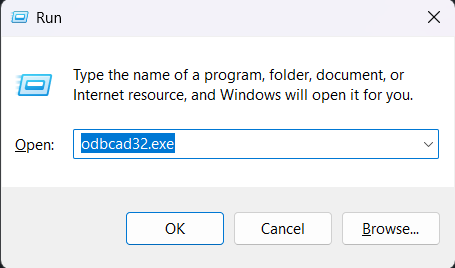

We need to figure out the name of the ODBC driver for the Postgres, this will be needed to make a connection-string in the extension. 
In my case the highlighted below worked. 

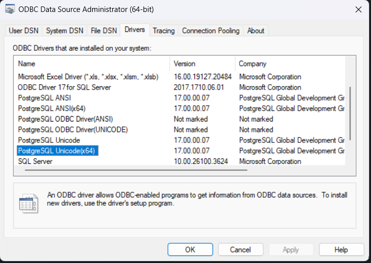

In case you have problem with the driver, you need to look over the global PATH variable and that the correct path is added to the ODBC-driver location

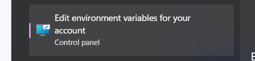

For my system its located here. If you dont have the path, make sure to add it. 

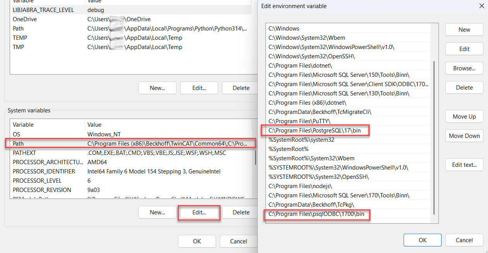

This is how my connection string looks like that the HMI-Server Extension wants

(Make sure you change the connection string so it fits your server location, database name, username and password)

```
Driver={PostgreSQL Unicode(x64)};Server=localhost;Port=5432;Database=hmiExtension;Uid=Jack;Pwd=@password;
```

## TwinCAT HMI Configuration + Installation

1. First you need to install the package "TwinCAT.HMI.Database" via TcPkg. Currently it's only avialable in the Preview-feed

```
tcpkg install TwinCAT.HMI.Database 
```
2. Then in your TwinCAT HMI Project, you need to install the nuget package "Beckhoff.TwinCAT.HMI.Database"

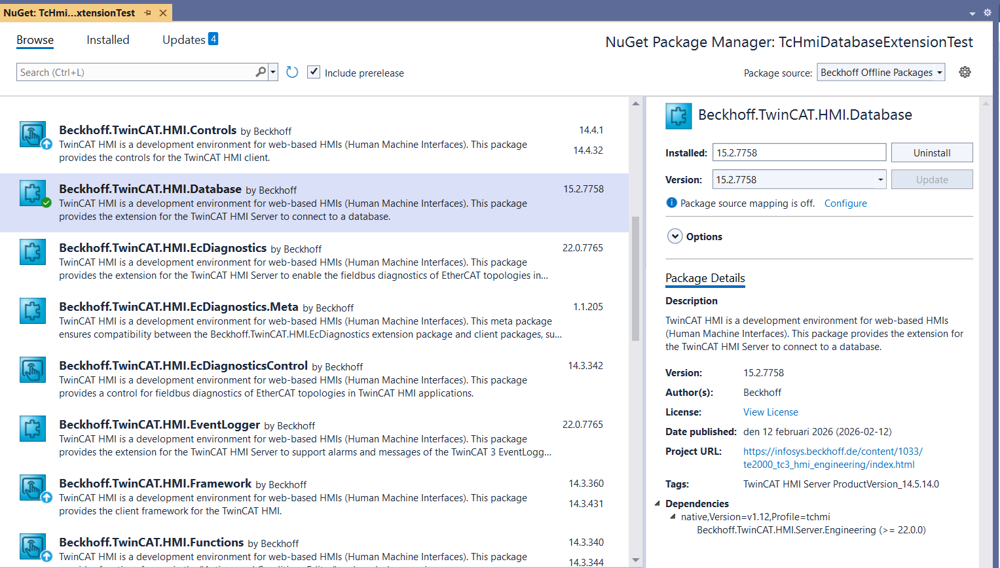

3. After the nuget installation you should under the Server see the new "TcHmiDatabase" module. If it's now showing a green arrow as in the picture below, you most likely have a license error. Check the Error list window for more information.

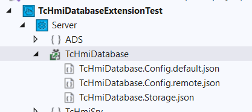

4. Double click the "TcHmiDatabase" module shown in the picture above and this will open up the configuration page of this extension. Under the General tab we have the possibility to add our database connection.
5. Press "Add" and fill in the information. It's recommended to use the Password field and pass the password with the @password parameter to the connection string. This will ensure that the password is encrypted in the HMI project.

   

6. After the database has been added we can check under the Diagnostics tab that the connection state is "Good"

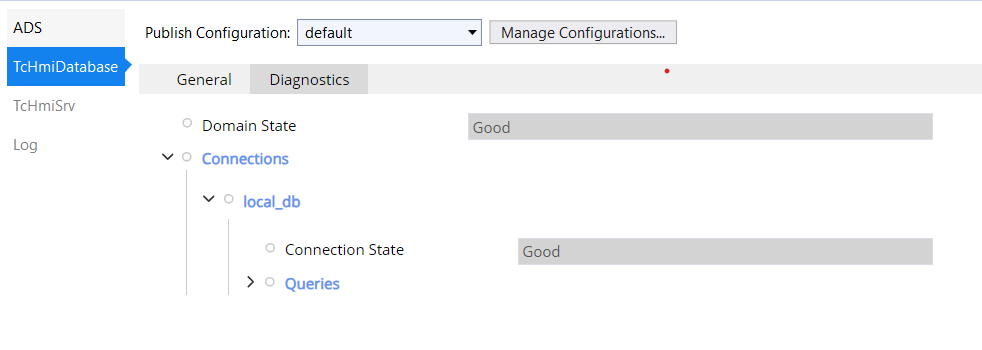  

7. Done! Now we can continue with the Read / Write to database

## Read from database

### Show Table data

1. First lets add a table with some dummy data to the database. I added this data with pgAdmin 4 software.

```sql
CREATE TABLE machines (  id INT,  type VARCHAR(255), active BOOL);
INSERT INTO machines (id, type, active)VALUES    (1, 'drive', false),    (2, 'pump', false),    (3, 'conveyor', true);
```

After we have created the new table with data with the query above we now have data to show in the HMI. 

In the database hmi configuration we have the option to enable table browsing

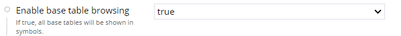

Then we will get our tables listed as individual symbols here

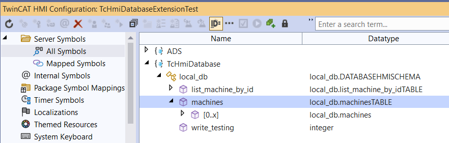

2. Now we can link this symbol to a DataGrid and create a data-binding to "Src Data" property

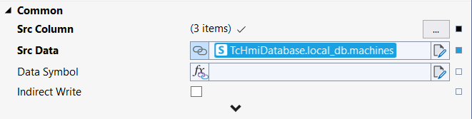

3. Then we need to configure the "Src Column" property in our DataGrid to define which data to show and where

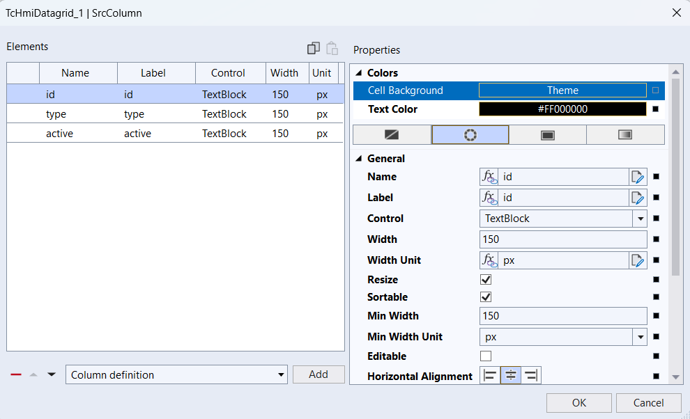

4. Then we can see the result in the LiveView

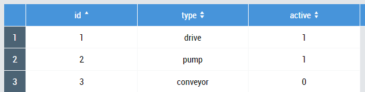

### Show data from specific SQL query

Another way to show data is to add a query that can be executed over the server

In this sample we will add a query that list the machine by id

1. Go to the "TcHmiDatabase" configuration and under "Queries" press "Add"

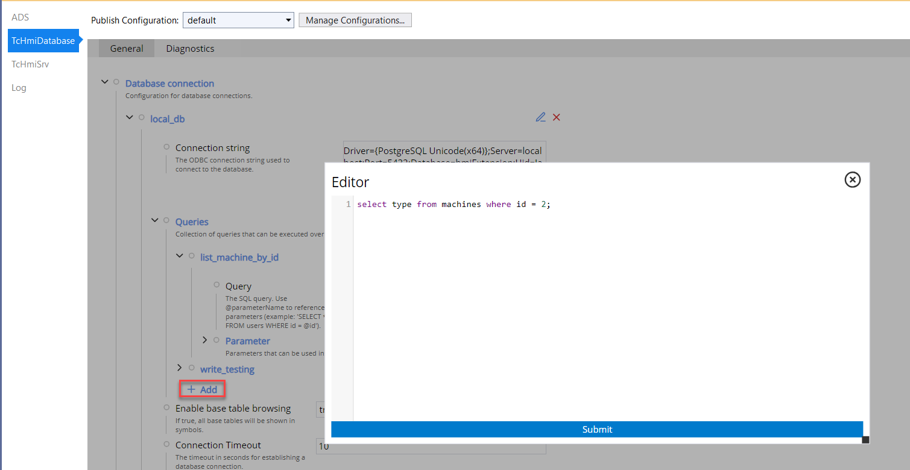

```sql
select type from machines where id = 2;
```

2. Then you should have a new "list_machine_by_id" symbol available with a "type" symbol inside

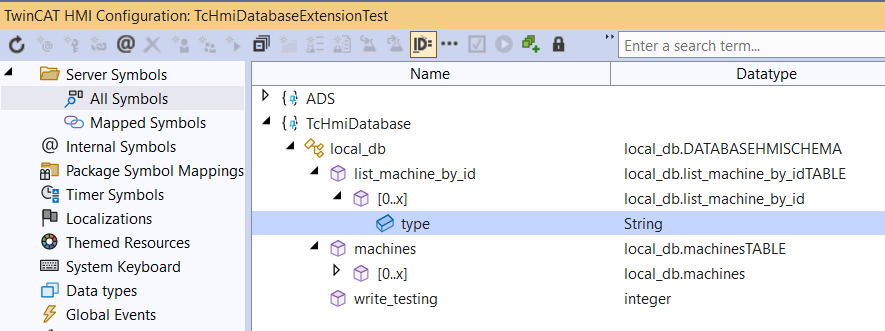

3. Then we can link the new symbol to a TcHmiTextblock to show the data

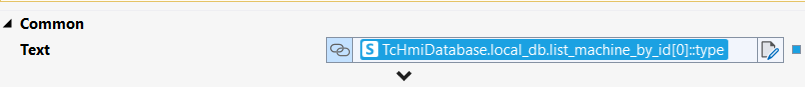

4. And here we can see the result for id = 2

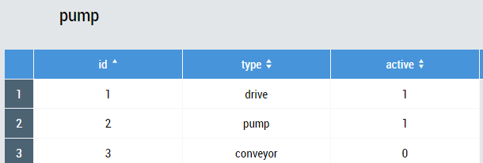

This will only show the data when the id = 2, but maybe you want it to be more dynamic and change the id? 

5. Start with changing the sql query and update it with

```sql
select type from machines where id = @id;
```
6. Then we also need to define the parameter under the new query

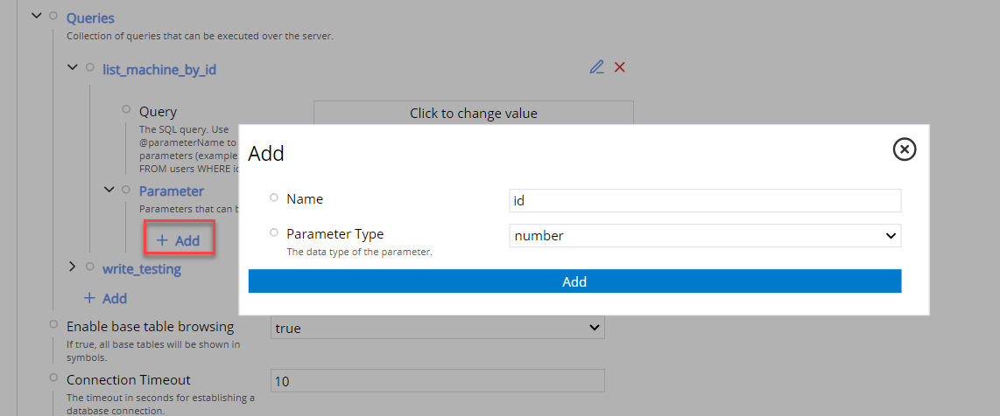   

7. Now add a new JavaScript (Function) to the project

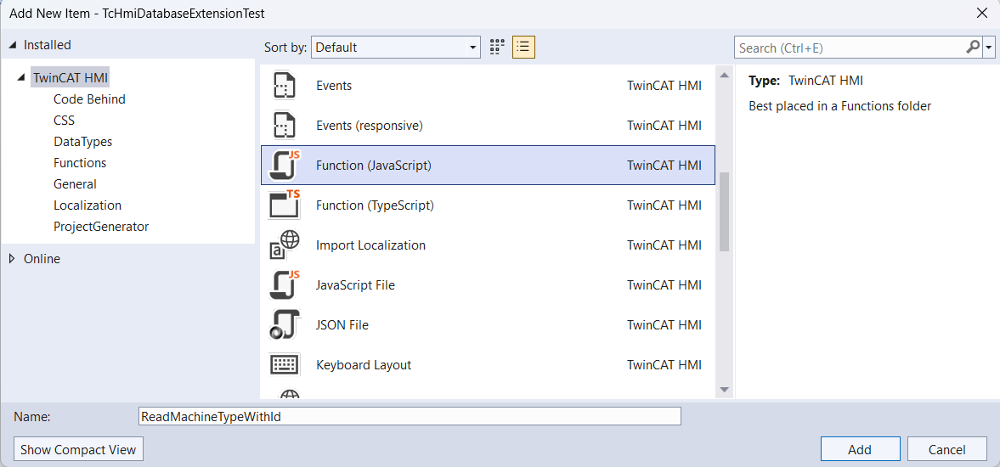

8. Change the parameter and data type we want to pass in to our new function here. Because the server request method is asynchronous we need to also change the function to act accordingly and wait for the result before we exit the function

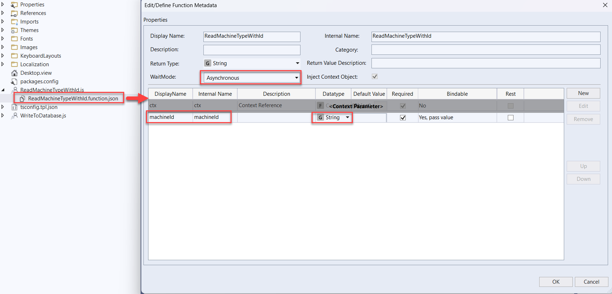   

9. Then we can add our javascript code inside the new function

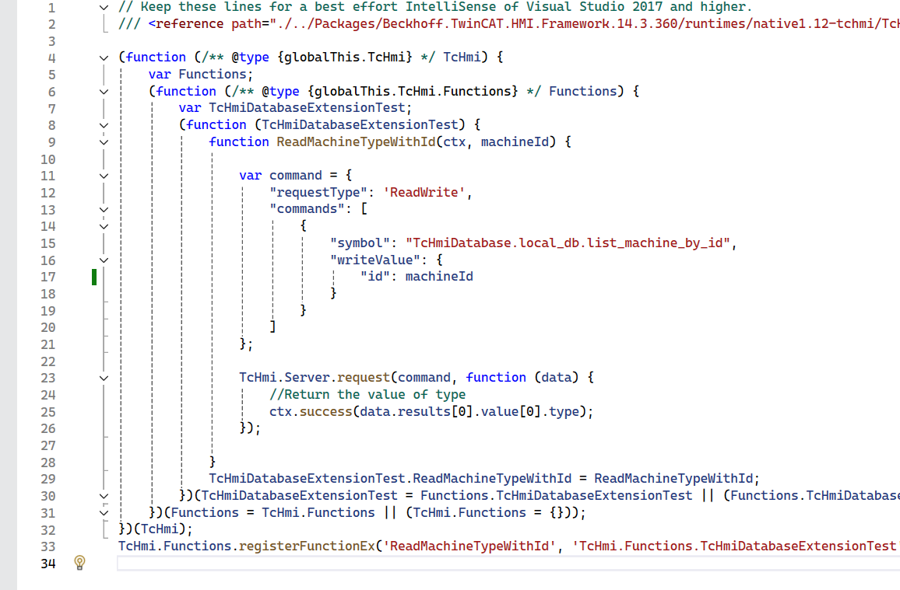 

```js
var command = {
    "requestType": 'ReadWrite',
    "commands": [
        {
            "symbol": "TcHmiDatabase.local_db.list_machine_by_id",
            "writeValue": {
                "id": machineId
            }
        }
    ]
};

TcHmi.Server.request(command, function (data) {
    //Return the value of type
    ctx.success(data.results[0].value[0].type); 
});
```
10. Then as the last step we call the function, for example directly inside the Text property in a TcHmiTextblock. Make sure to pass a value inside "machineId" or create a data-binding for a symbol. Otherwise it will not work :)

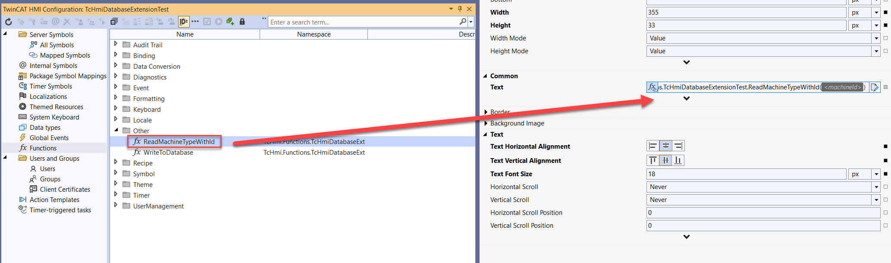 

## Write to database

1. First define a new query with parameters 
2. Give the parameters a suitable name and a data type (in my sample below "myId" and "newActive")

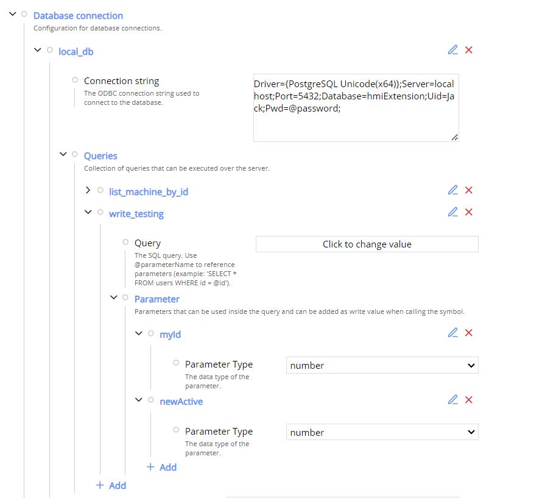

3. Then click "Click to change Value" in the picture above to edit the query.

This is my sample query to update the active value depending on the specific id

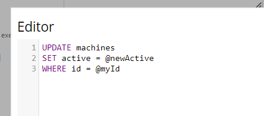

4. Double check under diagnostic after creating the new query that the db extension thinks its "good"


5. Then you need to map the new query so its a mapped symbol. Otherwise we cannot call it

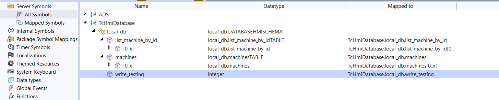

6. Then create a javascript function that uses the request method. Define the command with the symbol name and the parameters you defined to pass the new data to the database!


```js
function WriteToDatabase(myId, newActive) {

    var command = {
        "commands": [
            {
                "commandOptions": [
                    "SendErrorMessage",
                    "SendWriteValue"
                ],
                "symbol": "TcHmiDatabase.local_db.write_testing",
                "writeValue": {
                    "myId": myId,
                    "newActive": newActive
                }
            }
        ]
    };

    TcHmi.Server.request(command, function (data) {
        console.log(data);
    });

}
