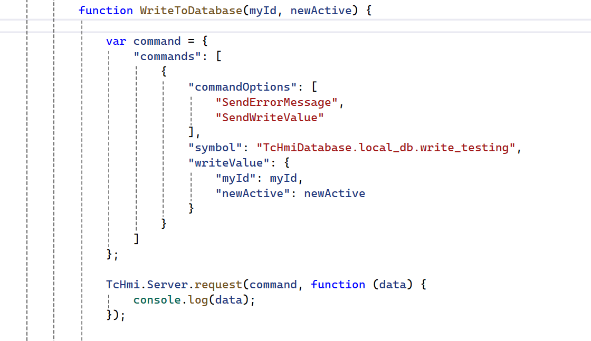

# Notes to getting started with TF2120 HMI Database

## Disclaimer

This guide is a personal project and not a peer-reviewed publication or sponsored document. It is provided “as is,” without any warranties—express or implied—including, but not limited to, accuracy, completeness, reliability, or suitability for any purpose. The author(s) shall not be held liable for any errors, omissions, delays, or damages arising from the use or display of this information.

All opinions expressed are solely those of the author(s) and do not necessarily represent those of any organization, employer, or other entity. Any assumptions or conclusions presented are subject to revision or rethinking at any time.

Use of this information, code, or scripts provided is at your own risk. Readers are encouraged to independently verify facts. This content does not constitute professional advice, and no client or advisory relationship is formed through its use.

## System requirements

Tested with PostgreSQL 17

Tested with HMI Engineering/Server 14.12

Tested with TwinCAT.HMI.Database 14.5.12

TF2120 or TF6420 license needed (trial works)

## OBDC Notes

You need to have ODBC driver on your system to get this to work
https://odbc.postgresql.org/


We need to figure out the name of the ODBC driver for the Postgres, this will be needed to make a connection-string in the extension. 
In my case the highlighted below worked. 


In case you have problem with the driver, you need to look over the global PATH variable and that the correct path is added to the ODBC-driver location


For my system its located here. If you dont have the path, make sure to add it. 


This is how my connection string looks like that the HMI-Server Extension wants

```
Driver={PostgreSQL Unicode(x64)};Server=localhost;Port=5432;Database=hmiExtension;Uid=Jack;Pwd=@password;
```

## Write To Database

First define a new query with parameters 
Give the parameters a suitable name and a data type (in my sample below "myId" and "newActive")


Then click "Click to change Value" in the picture above to edit the query. 
This is my sample query to update the active value depending on the specific id


Double check under diagnostic after creating the new query that the db extension thinks its "good"


Then you need to map the new query so its a mapped symbol. Otherwise we cannot call it


Then create a javascript function that uses the request method. Define the command with the symbol name and the parameters you defined to pass the new data to the database!



